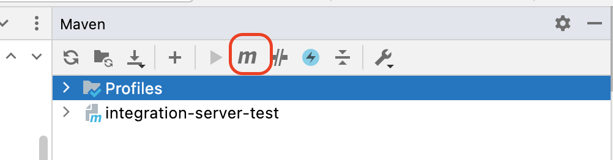
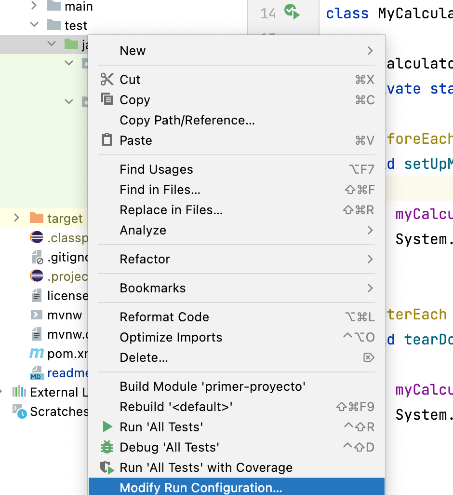
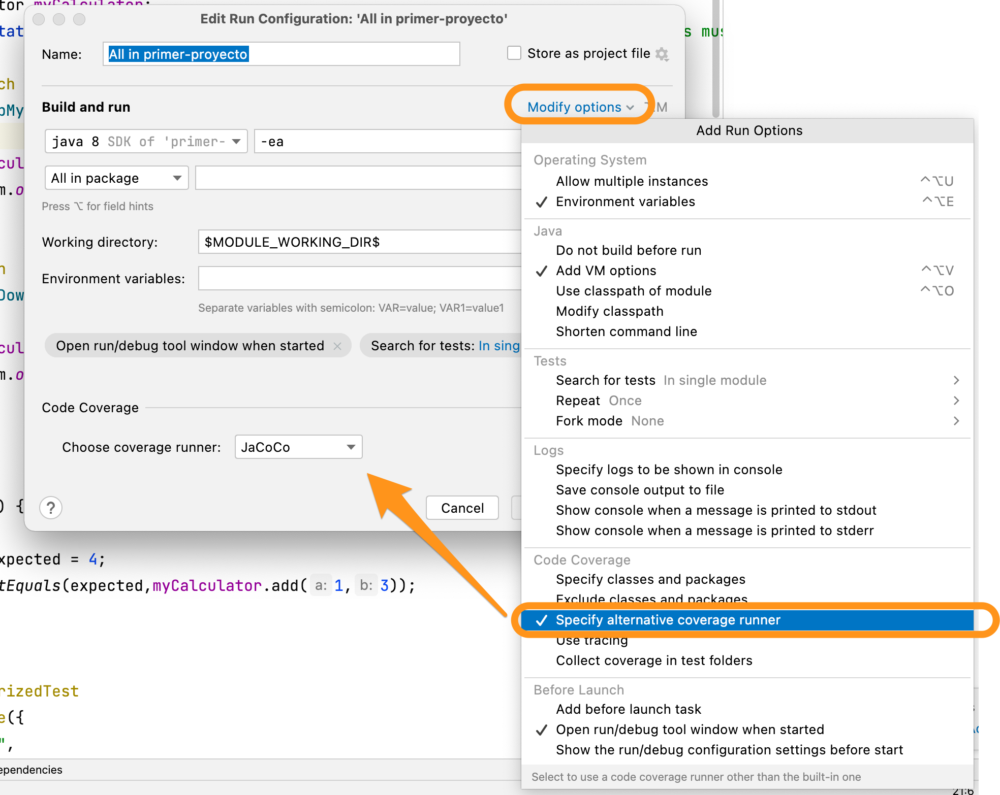
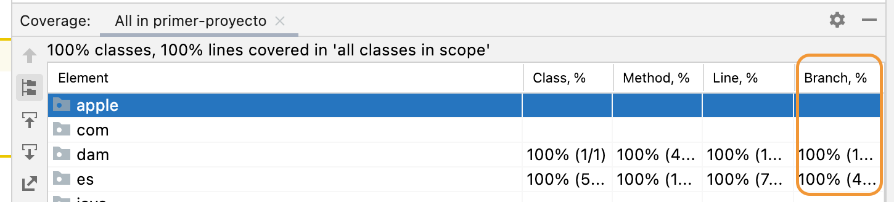

# Integration Server Test

Este proyecto se utiliza para probar determinados conceptos de testing vistos en clase. Es un proyecto maven que tiene integrado jacoco para realizar los tests de cobertura.

El comando maven para realizar la cobertura es:

```bash
mvn clean jacoco:prepare-agent install jacoco:report
```

La salida se generará en el directorio tarjet relativo [target/site/jacoco/index.html](target/site/jacoco/index.html)

## JaCoCo en un proyecto maven

La herramienta *Java Code Coverage* [JaCoCo](https://www.jacoco.org/jacoco/) es un plugin de maven que permite obtener la cobertura del código ( el porcentaje de código cubierto por los tests), calcular la complejidad ciclomática, etc.

Es una herramienta que inicialmente podía integrarse sólo en eclipse, pero que actualmente se integra en jenkins, IntelliJ IDEA, etc. Al utilizar **JaCoCo nos proporciona una medida del porcentaje de ramas de ejecución cubiertas por los tests** ( los tests de Cobertura de Intellij IDEA no proporcionan este dato).

Para integrarlo, hay que editar el fichero `pom.xml` y agregar el siguiene plugin:

```xml
<plugin>
    <groupId>org.jacoco</groupId>
    <artifactId>jacoco-maven-plugin</artifactId>
    <version>0.8.7</version>
    <executions>
        <execution>
            <goals>
                <goal>prepare-agent</goal>
            </goals>
        </execution>
        <execution>
            <id>report</id>
            <phase>prepare-package</phase>
            <goals>
                <goal>report</goal>
            </goals>
        </execution>
    </executions>
</plugin>
```

Una vez agregado, actualizamos el proyecto, mediante `maven install` por ejemplo y ya tendremos disponible el comando para lanzar los tests de cobertura. Para lanzarlo hay que ejecutar:

```bash

mvn clean jacoco:prepare-agent install jacoco:report

```

Este comando se puede lanzar desde la ventana de maven de IntelliJ (**View** > **Tool Windows** > **maven**) al pulsarlo nos dejará introducir el comando.



### Configurando el Coverage por defecto de IntelliJ

Tal como se indicó en el punto anterior, si ya hemos configurado el JaCoCo dentro del fichero de maven, podemos configurar IntelliJ Idea para que lo utilice de la siguiene manera:

Primero, hemos de pulsar con el botón derecho en el paquete de java de tests y acceder a **Modify Run Configurations** 

Posteriormente, ha de seleccionarse, **Modify Options** > **Specify Alternative Coverage Runner** y en el desplegable que se agregará, seleccionar **JaCoCo** una vez lo tengamos, seleccionamos aceptar y ya podremos ejecutar los tests de cobertura mediante JaCoCo en IntelliJ.



> Para revisar que se ha configurado correctamente, hay que ejecutar los tests unitarios con cobertura, y verficar que en la ventana de los resultados que aparece arriba a la derecha, podremos ver que aparece el **%branch** que es el porcentaje de ejecución de cada rama del código por los tests unitarios.



## Instalar Mockito

[Mockito](https://site.mockito.org/) es un framework para testing que se utiliza para simular comportamientos de clases y poder realizar tests unitarios sin necesidad de implementar las clases dependientes. De esta forma podemos hacer tests unitarios más fácilmente y conseguir que estén aislados.

Para agregarlo a nuestro proyecto maven, hemos de modificar el fichero `pom.xml` y agregar la dependencia para testing ddel framework

A la hora de redactar el manual la última versión era la 4.5.1

```xml
<!-- https://mvnrepository.com/artifact/org.mockito/mockito-core -->
<dependency>
    <groupId>org.mockito</groupId>
    <artifactId>mockito-core</artifactId>
    <version>4.5.1</version>
    <scope>test</scope>
</dependency>
```

Una vez agregada ya tendremos disponibles todos los paquetes relacionados con la clase.