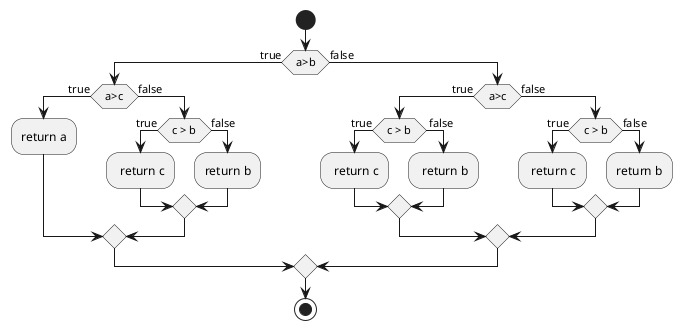

# Projecte de Proves de Test amb JUnit5

## majorDeTres

```puml
@startuml
start
if (a>b) then (true)
  if (a>c) then (true)
   :return a;
  else (false)
   if ( c > b ) then (true)
   : return c;
   else (false)
   :return b;
   endif
  endif
else (false)
  if (a>c) then (true)
   if ( c > b ) then (true)
   : return c;
   else ( false )
   : return b;
   endif 
  else (false )
   if ( c > b ) then (true)
   : return c; 
   else (false)
   :return b;
   endif
  endif
endif

stop
@enduml
```

